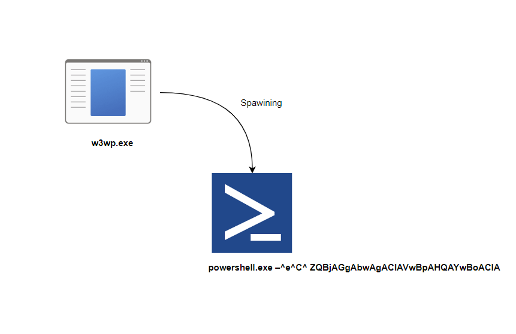

# Detection-Validation

## Purpose

The tool automates the process of simulating malicious process events without need to go through setup of real processes. 

Suppose you want to test w3wp.exe spawning Powershell, you will need to go through iis setup to simulate w3wp.exe events, which is a consuming task if you have many rules to validate. Since detection engines work based simple string matching from telemetry collection tools such as Sysmon or EDR, any binary with the same parent process name, child process name, commandline and path can be used to test the logic, hence no need to setup iis to simulate the behavior. 



The tool allow you to create a child process with a custom parent, child, commandline and path. In addition to couple of other events such as file create from specific process and path, DNS query, registry, and Process connections. 

```
NAME:
   Malware Cli - A new cli application

USAGE:
   main.exe [global options] command [command options] [arguments...]

DESCRIPTION:
   Detection validation tool.
   The objective is to generate event with specific conditions to validate detection rule.
   You can execute commands such as w3wp.exe spawning shell or winword creating file or making DNS queries.

COMMANDS:
   argsfree    Accept any commandline
   connect     Connect to host
   download    Download file
   dnsquery    Resolve DNS
   execute     Execute command with custom commandline and parent process
   encrypt     encrypt all files in a folder that match a pattern
   createfile  Create file at a spcific path
   reg         Add registry key
   help, h     Shows a list of commands or help for one command

GLOBAL OPTIONS:
   --help, -h  show help
```

## Examples

**winword.exe spawning cscript.exe**  

```
 mcli.exe execute --parent winword.exe --command cscript.exe
```

**rundll32.exe making DNS request** 

```
mcli.exe dnsquery --binpath c:\temp\rundll32.exe --host malicious.com
```

**w.exe creating file from path C:\temp**  

```
mcli.exe createfile --path f.dat --binpath c:\temp\w.exe
```

## Installation


### Windows (Powershell)

**Run app to download prerequisites and check execution**
```powershell
go run .
```
**Compile app**
```powershell
go build -o mcli.exe .
```
